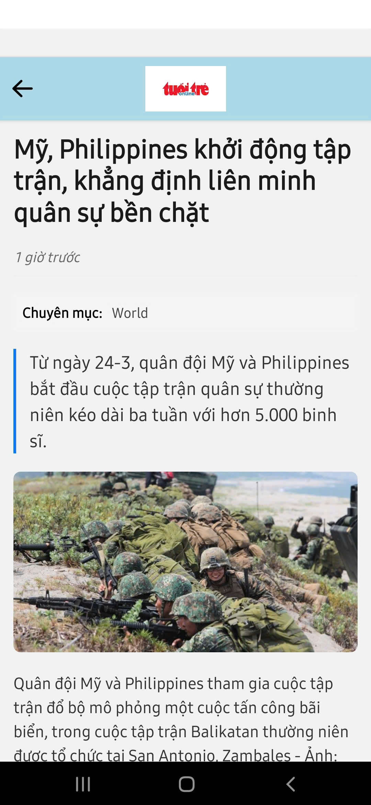
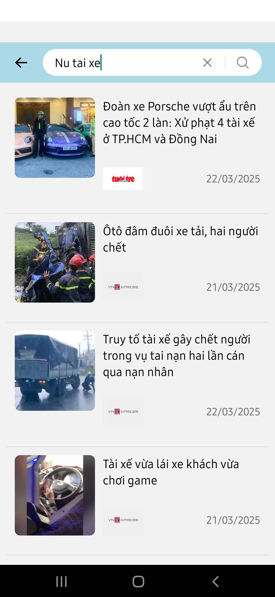
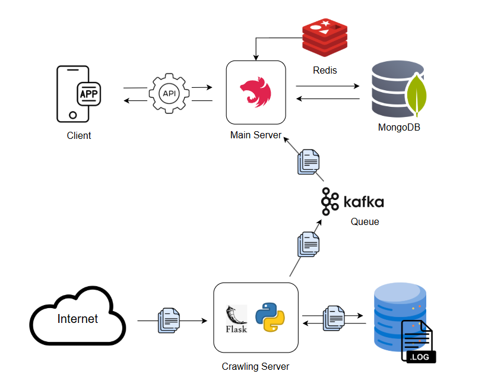

<p align="center">
  
</p>

<h1 align="center">BKExpress</h1>

<p align="center">
  
</p>

## ✨ Features
Update the latest news quickly!!

Our app helps users stay informed with the newest headlines in real time. With a clean interface and seamless navigation, you can easily explore categories, read breaking news, and stay up-to-date anytime, anywhere.


✨ **In our first release**, we provide paper viewing and search functionality.
We're excited to announce that more features are coming in our next updates!
### Viewing papers according to Category
<p align="center">
  
  
</p>

### Searching
<p align="center">
  
</p>

# 📥 Download My App
<p align="center">
  <a href="https://drive.google.com/file/d/1_fgHQY7TM_mVVD8G-0O4AE5M-6tb_Kti/view?usp=sharing">
    
  </a>
</p>

#  System Design & Implementation:
<p align="center">
  
</p>

### We applied Microservices architecture and deployed with Docker.

- [x] Main server: Responsible for handling business logic, APIs, and database interaction.
- [x] Database: MongoDB Manages Data, structure data, Redis manages cache.
- [x] Crawler: Crawler is used for collecting news data from online sources .
- [x] Service-to-Service Communication : Kafka is used for asynchronous event streaming. 
# Getting started
### For server 
**This is just the guideline for local server only!!!**

```bash
git clone https://github.com/Geawn/BKExpress.git
```
For first time
```bash
cd BE
docker-compose up --build
```
For later run
```bash
cd BE
docker-compose up 
```

fill for backend url in app with the url that backend provide.


